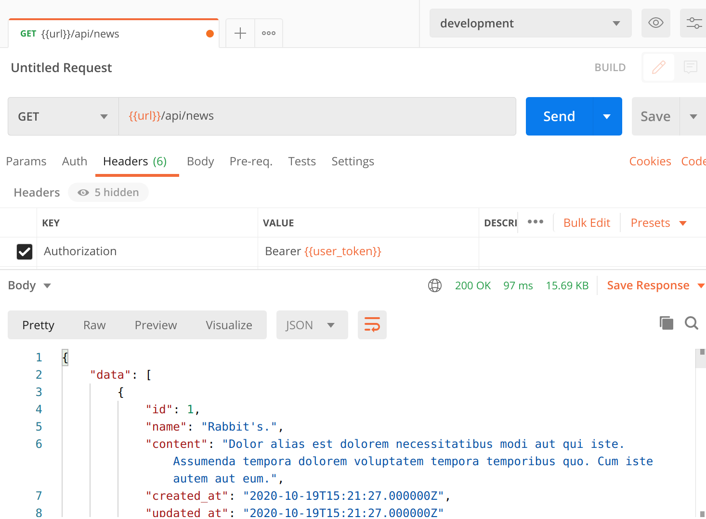
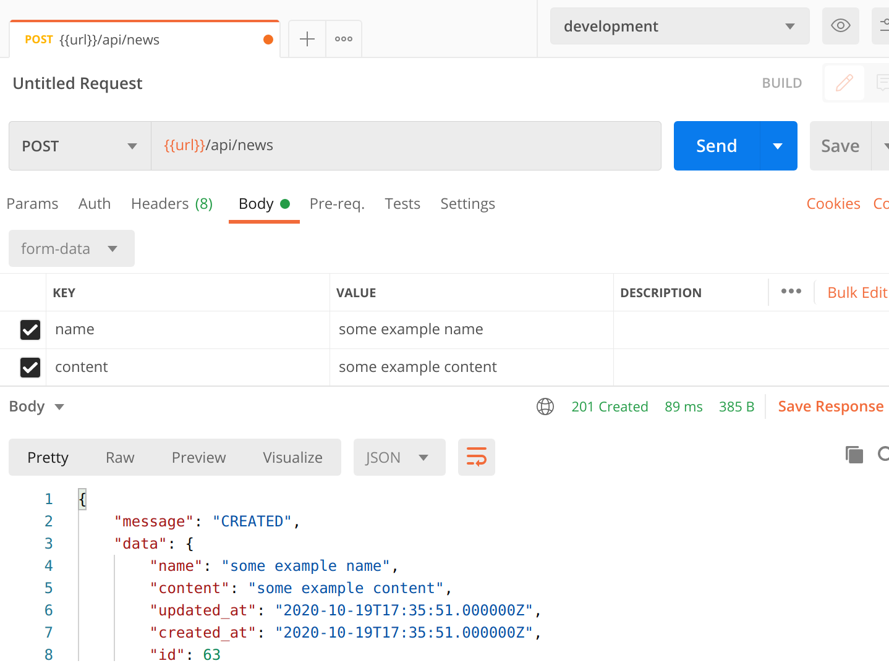

# News API

REST API build with Lumen Framework

## What can I do with this API?
With this newsAPI you can:
- Create news about your company. Endpoint: POST {url}/api/news
- Get all news created and show them to the user. Endpoint: GET {url}/api/news 

### Examples

Results when making a GET request to {url}/api/news:

Results when making a POST request to {url}/api/news:

## Installing

Check the [installation doc](INSTALLING.md) section

## Testing

Check the [testing doc](TESTING.md) section

## Requirements

TODO:
